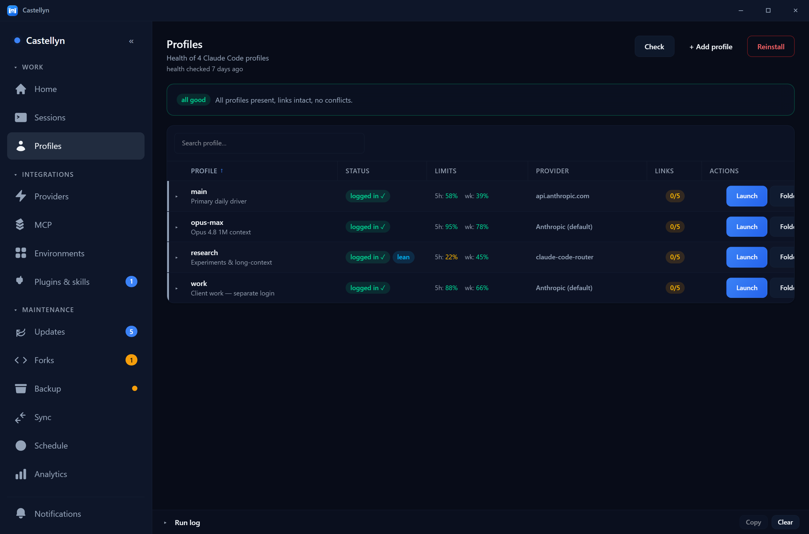
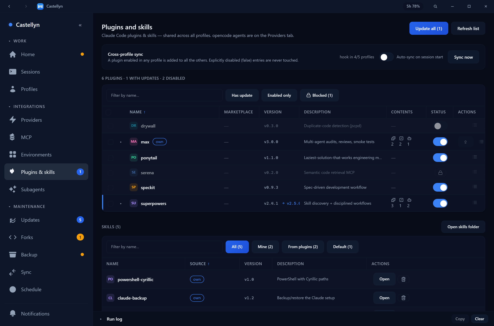
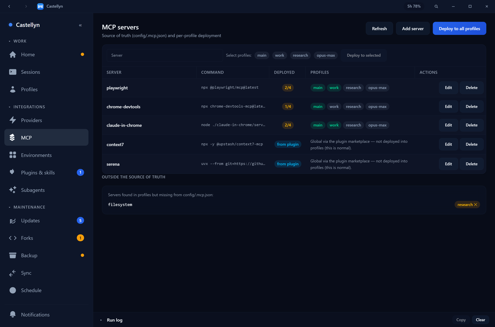
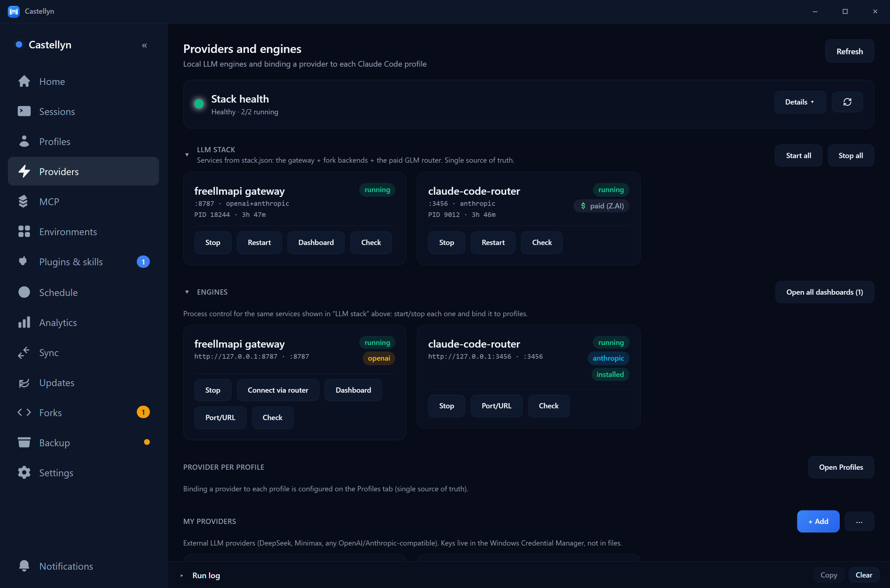
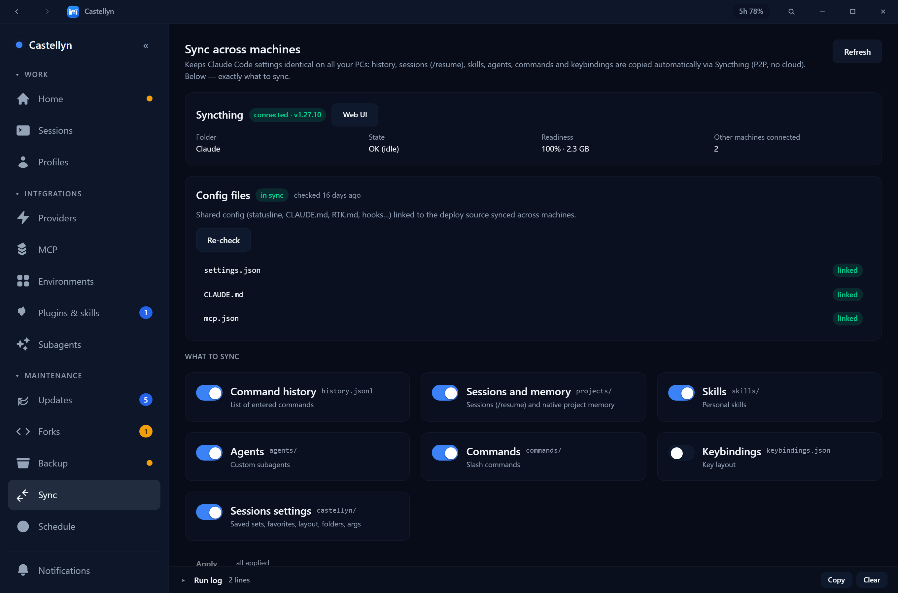

<div align="center">


# Castellyn

**One native control center for your whole AI‑coding dev environment** — profiles, providers & routers, MCP, plugins & skills, parallel sessions and fork upkeep in a single Tauri desktop app, instead of a dozen terminals and scripts.

[](https://github.com/danscMax/castellyn/stargazers)


[](LICENSE)

🇬🇧 [English](#english) · 🇷🇺 [Русский](#русский) · 🇨🇳 [中文](#中文)

</div>

## Screenshots · Скриншоты · 截图

<table>
<tr>
<td width="50%" align="center"><b>Profiles · Профили · 配置</b><br></td>
<td width="50%" align="center"><b>Plugins &amp; skills · Плагины и скиллы · 插件与技能</b><br></td>
</tr>
<tr>
<td align="center"><b>MCP</b><br></td>
<td align="center"><b>Providers &amp; engines · Провайдеры · 提供商</b><br></td>
</tr>
<tr>
<td colspan="2" align="center"><b>Sync · Синхронизация · 同步</b><br></td>
</tr>
</table>

---

<a id="english"></a>

## English

> If you run **Claude Code** (and/or **opencode**) seriously — multiple accounts, custom providers, a router, MCP servers, plugins, skills, parallel sessions across machines — you end up juggling a pile of terminals, JSON files and PowerShell scripts. **Castellyn** puts all of that behind one fast native window.

### Why Castellyn

- **Stop context‑switching.** Every moving part of a local AI‑coding setup — accounts, providers, MCP, extensions, sessions, maintenance — lives on one screen.
- **Native, not Electron.** Tauri v2 + Rust backend: tiny, fast, low‑memory; the UI streams real command output instead of guessing.
- **Multi‑profile by design.** Built for people who keep several Claude Code identities (`~/.claude-<name>`) with shared folders, separate logins and per‑profile providers.
- **Trilingual UI.** Live switch between **English / Русский / 中文**, no restart.

### Features

| | Tab | What it does |
|---|---|---|
| ▦ | **Sessions** | Spin up **parallel terminal sessions** (real PTY, xterm.js) and launch Claude Code or opencode in any profile + provider — several agents side by side in one window. |
| ☰ | **Profiles** | Full lifecycle of Claude Code profiles (`~/.claude-<name>`): add / rename / recolor, repair junction & symlink health, edit shared folders, see **login status + usage limits (5h / weekly)**, bind a provider, launch. |
| ⚡ | **Providers** | Local LLM engines (start/stop, port status), custom providers, and **claude‑code‑router** binding so any OpenAI‑style backend can drive a profile. |
| ⧉ | **MCP** | A source‑of‑truth `.mcp.json` and a **per‑profile deployment matrix** — one click to push MCP servers to every profile. |
| 🧩 | **Plugins & skills** | Manage Claude Code plugins **and skills** in sortable tables: enable / disable / update / remove, bulk actions, and clear **ownership** (your own marketplace vs. third‑party vs. default). |
| 🕒 | **Schedule** | Run maintenance automatically via **Windows Task Scheduler**. |
| 📊 | **Analytics** | Usage analytics for the local gateway (requests, tokens, savings) with sparklines and CSV export. |
| ⇄ | **Sync** | What syncs between machines via **Syncthing** (history, projects, skills, agents, commands, keybindings) — edits `.stignore`, shows live status. |
| ⟳ | **Updates** | Check / apply updates across the whole stack (plugins, forks, RTK, SpecKit, opencode, ccr, gateway, Cargo bins) — per‑component cards + an “update all” orchestrator. |
| ⑂ | **Forks** | Status of your GitHub forks vs. upstream (merged / open / conflict branches, PR + CI) with safe per‑repo actions: fast‑forward, delete‑merged, rebase, normalize remotes. |
| ⛁ | **Backup** | Config snapshots of all profiles + restore, behind a mandatory `-WhatIf` preview gate. |
| ⚙ | **Settings** | Theme, **language (EN / RU / 中文)**, scripts path, global show/hide hotkey, autostart, timeouts, about. |

**Plus:** a reusable dense data‑table (sort, search, resize, row‑expand, bulk select), per‑profile usage badges, `Ctrl+K` command palette, collapsible sidebar with “needs‑attention” badges, system tray, custom themed window chrome, and a fully internationalized UI with no‑restart language switch.

### Quick start

```bash
npm install
npm run tauri dev      # run the app with hot reload
```

Build a release exe + desktop shortcut:

```powershell
.\build_all.ps1            # standalone exe
.\build_all.ps1 -Bundle    # + NSIS / MSI installers
```

### How it works

Castellyn is a thin, fast native shell over the maintenance scripts under `SCRIPTS_ROOT` (env → Settings → default `E:\Scripts`). The Rust backend runs them, streams their output live, and exposes typed `#[tauri::command]`s; the Svelte 5 frontend renders status, drives actions and stays fully reactive. Heavier, AgentHub‑exclusive logic is being ported to native Rust over time.

> **Platform:** Windows‑first (PowerShell maintenance scripts, Windows Terminal, Task Scheduler).

### Tech

Tauri v2 · SvelteKit (static/SPA) · Svelte 5 runes · TypeScript · Tailwind · Rust (serde, tokio, ureq) · PowerShell.

### Documentation

- [docs/ARCHITECTURE.md](docs/ARCHITECTURE.md) — how it fits together
- [docs/BUILD.md](docs/BUILD.md) — build, release, icon, troubleshooting
- [docs/I18N.md](docs/I18N.md) — localization & adding strings/locales

### Contributing

Issues and PRs are welcome. Keep the gates green: `npm run check` (0 errors / 0 warnings), `npm run check:i18n` (locale parity), `npm run build`, and `cargo check`.

### License

Released under the **MIT License** — see [LICENSE](LICENSE).

---

<a id="русский"></a>

## Русский

> Если вы серьёзно работаете с **Claude Code** (и/или **opencode**) — несколько аккаунтов, свои провайдеры, роутер, MCP‑серверы, плагины, скиллы, параллельные сессии на разных машинах — всё это превращается в кучу терминалов, JSON‑файлов и PowerShell‑скриптов. **Castellyn** собирает это в одно быстрое нативное окно.

### Зачем Castellyn

- **Хватит переключаться.** Все части локального AI‑кодинг‑окружения — аккаунты, провайдеры, MCP, расширения, сессии, обслуживание — на одном экране.
- **Нативно, не Electron.** Tauri v2 + бэкенд на Rust: лёгкий, быстрый, экономный; UI показывает реальный вывод команд, а не «как будто».
- **Мульти‑профиль с самого начала.** Сделан для тех, у кого несколько профилей Claude Code (`~/.claude-<имя>`) с общими папками, отдельными логинами и провайдером на каждый профиль.
- **Трёхъязычный интерфейс.** Живое переключение **English / Русский / 中文** без перезапуска.

### Возможности

| | Вкладка | Что делает |
|---|---|---|
| ▦ | **Сессии** | **Параллельные терминалы** (настоящий PTY, xterm.js): запуск Claude Code или opencode в любом профиле с выбранным провайдером — несколько агентов рядом в одном окне. |
| ☰ | **Профили** | Полный жизненный цикл профилей Claude Code (`~/.claude-<имя>`): добавить / переименовать / перекрасить, починить junction‑/symlink‑связи, общие папки, **статус логина + лимиты (5ч / неделя)**, привязка провайдера, запуск. |
| ⚡ | **Провайдеры** | Локальные LLM‑движки (старт/стоп, статус портов), кастомные провайдеры и привязка через **claude‑code‑router** — любой OpenAI‑совместимый бэкенд на профиль. |
| ⧉ | **MCP** | Источник истины `.mcp.json` и **матрица развёртывания по профилям** — в один клик раскатать MCP‑серверы на все профили. |
| 🧩 | **Плагины и скиллы** | Управление плагинами **и скиллами** Claude Code в таблицах: вкл/выкл/обновить/удалить, массовые действия и понятная **принадлежность** (свой маркетплейс / сторонний / дефолтный). |
| 🕒 | **Расписание** | Автоматическое обслуживание через **планировщик Windows**. |
| 📊 | **Аналитика** | Аналитика использования локального шлюза (запросы, токены, экономия) со спарклайнами и выгрузкой в CSV. |
| ⇄ | **Синхронизация** | Что синхронизируется между машинами через **Syncthing** (история, проекты, скиллы, агенты, команды, хоткеи) — правит `.stignore`, показывает статус. |
| ⟳ | **Обновления** | Проверка/установка обновлений всего стека (плагины, форки, RTK, SpecKit, opencode, ccr, шлюз, Cargo‑бинарники) — карточки по компонентам + «обновить всё». |
| ⑂ | **Форки** | Статус ваших форков на GitHub против upstream (merged / open / конфликтные ветки, PR + CI) и безопасные действия: fast‑forward, удалить смерженные, rebase, нормализовать remotes. |
| ⛁ | **Бэкап** | Снапшоты конфигов всех профилей + восстановление с обязательным предпросмотром `-WhatIf`. |
| ⚙ | **Настройки** | Тема, **язык (EN / RU / 中文)**, путь к скриптам, глобальный хоткей показа/скрытия, автозапуск, таймауты, «о программе». |

**А ещё:** переиспользуемая плотная таблица (сортировка, поиск, ресайз, раскрытие строк, массовый выбор), бейджи лимитов на профиль, палитра команд `Ctrl+K`, сворачиваемый сайдбар с бейджами «требует внимания», системный трей, кастомное оформление окна и полностью локализованный UI без перезапуска.

### Быстрый старт

```bash
npm install
npm run tauri dev      # запуск с горячей перезагрузкой
```

Сборка релизного exe + ярлык на рабочем столе:

```powershell
.\build_all.ps1            # автономный exe
.\build_all.ps1 -Bundle    # + установщики NSIS / MSI
```

### Как это устроено

Castellyn — тонкая быстрая нативная оболочка над обслуживающими скриптами в `SCRIPTS_ROOT` (env → Настройки → по умолчанию `E:\Scripts`). Бэкенд на Rust запускает их, стримит вывод в реальном времени и предоставляет типизированные `#[tauri::command]`; фронтенд на Svelte 5 рисует статус, запускает действия и остаётся полностью реактивным. Тяжёлую логику, нужную только Castellyn, постепенно переносим в нативный Rust.

> **Платформа:** Windows‑first (PowerShell‑скрипты, Windows Terminal, планировщик Windows).

### Технологии

Tauri v2 · SvelteKit (static/SPA) · Svelte 5 runes · TypeScript · Tailwind · Rust (serde, tokio, ureq) · PowerShell.

### Документация

- [docs/ARCHITECTURE.md](docs/ARCHITECTURE.md) — как всё устроено
- [docs/BUILD.md](docs/BUILD.md) — сборка, релиз, иконка, траблшутинг
- [docs/I18N.md](docs/I18N.md) — локализация и добавление строк/языков

### Вклад

Issues и PR приветствуются. Держите гейты зелёными: `npm run check` (0 ошибок / 0 предупреждений), `npm run check:i18n` (паритет локалей), `npm run build`, `cargo check`.

### Лицензия

Распространяется под лицензией **MIT** — см. [LICENSE](LICENSE).

---

<a id="中文"></a>

## 中文

> 当你认真使用 **Claude Code**（和/或 **opencode**）——多个账户、自定义提供商、路由器、MCP 服务器、插件、技能、跨机器的并行会话——迟早会被一堆终端、JSON 文件和 PowerShell 脚本淹没。**Castellyn** 把这一切统统收进一个快速的原生窗口。

### 为什么选 Castellyn

- **告别频繁切换。** 本地 AI 编程环境的每个环节——账户、提供商、MCP、扩展、会话、维护——都集中在同一屏。
- **原生，而非 Electron。** Tauri v2 + Rust 后端：小巧、快速、省内存；界面实时流式展示真实的命令输出。
- **为多配置而生。** 专为同时维护多个 Claude Code 身份（`~/.claude-<name>`）、共享文件夹、独立登录与按配置绑定提供商的人打造。
- **三语界面。** **English / Русский / 中文** 实时切换，无需重启。

### 功能

| | 标签页 | 作用 |
|---|---|---|
| ▦ | **会话** | 开启**并行终端会话**（真实 PTY、xterm.js），以任意配置和指定提供商启动 Claude Code 或 opencode——多个智能体在同一窗口中并排运行。 |
| ☰ | **配置** | Claude Code 配置（`~/.claude-<name>`）的完整生命周期：新增 / 重命名 / 改色、修复 junction 与符号链接、共享文件夹、**登录状态与用量限额（5 小时 / 每周）**、绑定提供商、启动。 |
| ⚡ | **提供商** | 本地 LLM 引擎（启停、端口状态）、自定义提供商，并通过 **claude‑code‑router** 绑定，让任意 OpenAI 兼容后端驱动指定配置。 |
| ⧉ | **MCP** | 以 `.mcp.json` 作为唯一可信源，配合**按配置的部署矩阵**——一键将 MCP 服务器分发到所有配置。 |
| 🧩 | **插件与技能** | 在可排序表格中管理 Claude Code 插件**与技能**：启用 / 停用 / 更新 / 删除、批量操作，并清晰区分**归属**（本地自有市场 / 第三方 / 默认）。 |
| 🕒 | **计划** | 通过 **Windows 任务计划程序**自动执行维护。 |
| 📊 | **分析** | 本地网关的用量分析（请求数、令牌、节省）——附迷你趋势图与 CSV 导出。 |
| ⇄ | **同步** | 通过 **Syncthing** 控制在多台机器间同步哪些内容（历史、项目、技能、智能体、命令、快捷键）——可编辑 `.stignore`，并显示实时状态。 |
| ⟳ | **更新** | 检查 / 应用整个技术栈的更新（插件、分叉、RTK、SpecKit、opencode、ccr、网关、Cargo 二进制）——按组件分卡片，并提供「全部更新」。 |
| ⑂ | **分叉** | 你在 GitHub 上各分叉相对上游的状态（已合并 / 开放 / 冲突分支、PR 与 CI），以及安全的逐仓操作：快进、删除已合并分支、变基、规范化远程。 |
| ⛁ | **备份** | 对所有配置进行快照备份与恢复，并强制 `-WhatIf` 预览确认。 |
| ⚙ | **设置** | 主题、**语言（EN / RU / 中文）**、脚本路径、全局显示/隐藏热键、开机自启、超时、关于。 |

**此外还有：** 可复用的紧凑数据表（排序、搜索、调整列宽、展开行、批量选择）、按配置显示的用量徽章、`Ctrl+K` 命令面板、带「需关注」徽章的可折叠侧边栏、系统托盘、自定义窗口外观，以及无需重启即可切换语言的完整本地化界面。

### 快速开始

```bash
npm install
npm run tauri dev      # 带热重载运行
```

构建发布版 exe + 桌面快捷方式：

```powershell
.\build_all.ps1            # 独立 exe
.\build_all.ps1 -Bundle    # + NSIS / MSI 安装包
```

### 工作原理

Castellyn 是位于 `SCRIPTS_ROOT`（环境变量 → 设置 → 默认 `E:\Scripts`）下维护脚本之上的一层轻量原生外壳：Rust 后端负责运行脚本、实时流式输出，并暴露带类型的 `#[tauri::command]`；Svelte 5 前端负责渲染状态、触发操作，并保持完全响应式。仅 Castellyn 专用的较重逻辑正逐步迁移为原生 Rust。

> **平台：** 以 Windows 为先（PowerShell 脚本、Windows Terminal、任务计划程序）。

### 技术栈

Tauri v2 · SvelteKit（static/SPA）· Svelte 5 runes · TypeScript · Tailwind · Rust（serde、tokio、ureq）· PowerShell。

### 文档

- [docs/ARCHITECTURE.md](docs/ARCHITECTURE.md) — 整体架构
- [docs/BUILD.md](docs/BUILD.md) — 构建、发布、图标、排错
- [docs/I18N.md](docs/I18N.md) — 本地化与新增字符串/语言

### 贡献

欢迎提交 Issue 与 PR。提交前请确保各项检查通过：`npm run check`（0 错误 / 0 警告）、`npm run check:i18n`（多语言一致性）、`npm run build`、`cargo check`。

### 许可证

基于 **MIT 许可证** 发布，详见 [LICENSE](LICENSE)。

---

## Support · Поддержать · 支持

If Castellyn saves you time, you can support development — спасибо! · 谢谢！

- ☕ **Cards / Карты (RU)** — [CloudTips](https://pay.cloudtips.ru/p/9b14d4f1)
- 💎 **TON** — `UQBMEMUpZZmrnnZoFseXuewWD1RkyVYw5EuBqTAOIl-AuOgM`
- ₮ **USDT (TRC20)** — `TLuHigjqe8gjwfidfi2F7SZ4z27e4uShS6`

---

<div align="center">
<sub>Castellyn · made for people who run a lot of AI coding · ⭐ star it if it saves you a terminal</sub>
</div>
